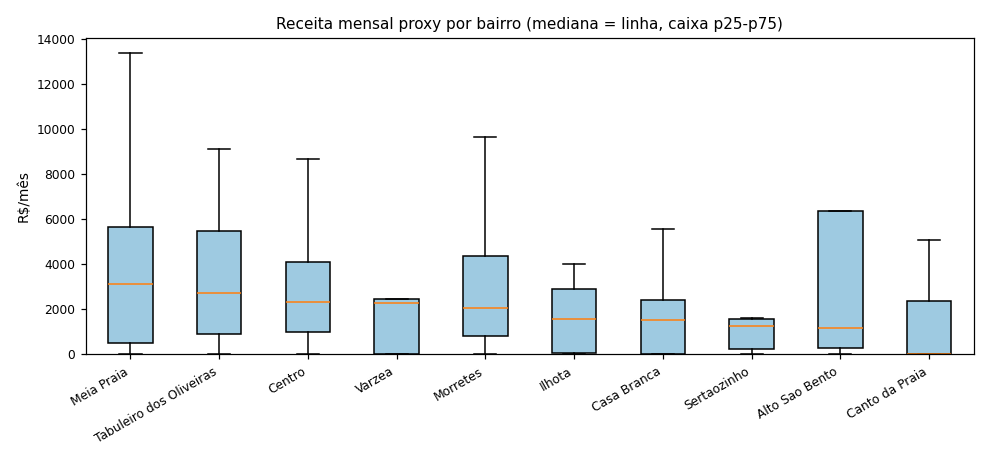
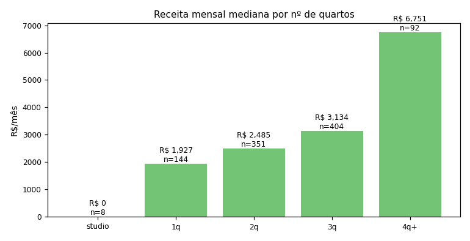
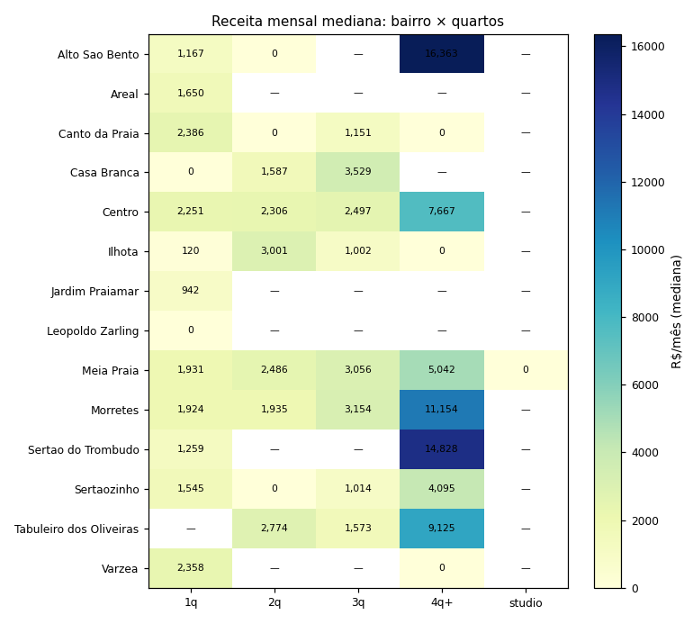
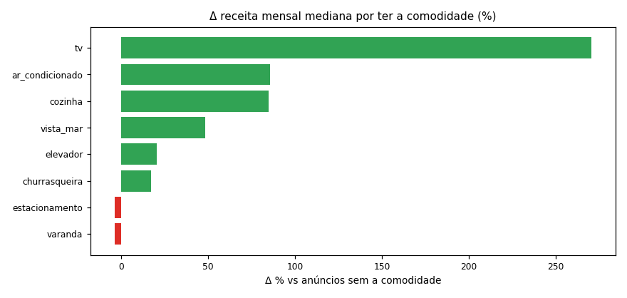

# Fase 3 — Análise exploratória (receita, localização, perfil)

> Receita mensal proxy = `preco_mediano (Price_AV) × occ_proxy × 365 / 12`. 
> occ_proxy é limite inferior (snapshot jan/2025) — valores conservadores. 
> Apenas anúncios com preço e bairro; rankings com N>=5.

## 1. Receita mensal por bairro (ranking) — N e dispersão

| suburb                  |   n |   mediana |   media |    p25 |     p75 |     std |   cv |
|:------------------------|----:|----------:|--------:|-------:|--------:|--------:|-----:|
| Meia Praia              | 632 |   3124.11 | 3969.02 | 493.49 | 5653.35 | 4395.94 | 1.11 |
| Tabuleiro dos Oliveiras |  20 |   2722.02 | 3802.9  | 902.25 | 5464.37 | 4004.12 | 1.05 |
| Centro                  | 205 |   2340.52 | 3082.43 | 988.9  | 4081.25 | 3232.07 | 1.05 |
| Varzea                  |   5 |   2266.04 | 2558.33 |   0    | 2449.44 | 3302.79 | 1.29 |
| Morretes                |  83 |   2060.48 | 3202.76 | 834.82 | 4365.7  | 3391.82 | 1.06 |
| Ilhota                  |  10 |   1589.76 | 1612.85 |  59.81 | 2884.4  | 1539.54 | 0.95 |
| Casa Branca             |  15 |   1512.47 | 1515.52 |   0    | 2415.92 | 1586.7  | 1.05 |
| Sertaozinho             |   6 |   1255.19 | 2048.91 | 253.47 | 1569.62 | 3088.09 | 1.51 |
| Alto Sao Bento          |   5 |   1166.67 | 4834.38 | 288.16 | 6353.7  | 6941.15 | 1.44 |
| Canto da Praia          |   9 |      0    | 1445.36 |   0    | 2385.54 | 1885.19 | 1.3  |

Leitura: mediana da receita mensal proxy (R$) por bairro, apenas bairros com N>=5 anúncios com preço. A mediana é a régua de comparação (não a média, puxada por outliers). 'cv' alto = receita instável entre os anúncios -> mesmo com mediana boa, o retorno é arriscado. Olhar também amplitude p25-p75.

## 2. Perfil — nº de quartos

| bedroom_cat   |   n |   receita_med |   diaria_med |   occ_med |   estrelas_med |
|:--------------|----:|--------------:|-------------:|----------:|---------------:|
| studio        |   8 |          0    |          435 |      0    |           4.88 |
| 1q            | 144 |       1927.41 |          385 |      0.16 |           4.93 |
| 2q            | 351 |       2485.48 |          450 |      0.19 |           4.92 |
| 3q            | 404 |       3133.92 |          650 |      0.16 |           4.94 |
| 4q+           |  92 |       6751.17 |         1090 |      0.24 |           4.94 |

## 2b. Perfil — tipo de anúncio

| listing_type_std   |   n |   receita_med |   diaria_med |   occ_med |
|:-------------------|----:|--------------:|-------------:|----------:|
| apartamento        | 911 |       2783.3  |          560 |      0.17 |
| casa               |  70 |       1929.56 |          500 |      0.1  |
| hotel              |   1 |       4907.22 |          330 |      0.49 |
| outros             |  17 |        751.47 |          150 |      0.13 |

Leitura: para cada corte de perfil, comparar receita mensal mediana — mas sempre cruzar com ocupeção e diária: receita alta pode vir de diária cara (pouca rotação) ou de alta rotação. O critério-mestre (yield/NOI) será aplicado na Fase 5 sobre estes perfis.

## 3. Cruzamento bairro × quartos — matriz de receita mensal mediana (R$)

Leitura: células coloridas = receita mensal mediana (R$) por bairro × quartos (apenas células com N>=5 via 'n' na tabela acompanhante — células com N pequeno não são conclusivas). Comparar a coluna '1q' (compactos) entre bairros: é o teste inicial da tese dos compactos no Centro.

## 3b. Comodidades — delta de receita (presença vs ausência)

| amenidade       |   n_pres |   n_aus |   receita_pres |   receita_aus |   delta_receita_pct |   occ_pres |   occ_aus |   diaria_pres |   diaria_aus |
|:----------------|---------:|--------:|---------------:|--------------:|--------------------:|-----------:|----------:|--------------:|-------------:|
| tv              |      985 |      14 |         2683.8 |         724.3 |               270.6 |        0.2 |       0.1 |         550   |        350   |
| ar_condicionado |      986 |      13 |         2676.7 |        1443.3 |                85.5 |        0.2 |       0.1 |         550   |        450   |
| cozinha         |      977 |      22 |         2722.9 |        1473.6 |                84.8 |        0.2 |       0.1 |         553   |        378   |
| vista_mar       |      153 |     846 |         3753.5 |        2527.7 |                48.5 |        0.2 |       0.2 |         648   |        527   |
| elevador        |      635 |     364 |         2846.6 |        2362.4 |                20.5 |        0.2 |       0.2 |         584.5 |        500   |
| churrasqueira   |      769 |     230 |         2739.5 |        2341.9 |                17   |        0.2 |       0.2 |         575   |        490   |
| estacionamento  |      957 |      42 |         2634   |        2734.5 |                -3.7 |        0.2 |       0.2 |         553   |        475.5 |
| varanda         |      405 |     594 |         2582.5 |        2686.6 |                -3.9 |        0.2 |       0.2 |         518   |        567   |
| academia        |      111 |     888 |         2340.5 |        2762.1 |               -15.3 |        0.2 |       0.2 |         509   |        557   |
| piscina         |      140 |     859 |         2326.1 |        2755.4 |               -15.6 |        0.2 |       0.2 |         509   |        557.5 |

Leitura: delta_receita_pct = quanto a presença da comodidade adiciona à receita mensal mediana (positivo = amenidade valorizada). Correção importante: amenities correlacionam-se com tamanho (piscina/varanda aparecem em apartamentos maiores) — o controle por quartos/vista será feito na Fase 4.

## Nota sobre amostra e edge-cases

- Bairros com N pequeno (Várzea n=5, Alto São Bento n=5, Canto da Praia n=9, Sertaozinho n=6) têm p25=0 e mediana instável — não são conclusivos; destacar apenas Meia Praia, Centro, Morretes, Tabuleiro, casa Branca, Ilhota.
- `occ_proxy=0` ocorre em anúncios cujo snapshot não registrou nenhuma noite bloqueada (captura rara) — é o piso do proxy, não 'vazio o ano todo'. O corte por `n_dates>=30` usado no heatmap reduz esse efeito.
- Studio tem n=8 apenas (base pequena): a tese dos compactos na prática aqui é sobre **1q**, e não studio.

## 4. Dependência de canal — profissionais / multi-listing

| n_listings_per_host   |   n_listings |   n_hosts |   receita_med |   occ_med |   diaria_med |
|:----------------------|-------------:|----------:|--------------:|----------:|-------------:|
| 1 (amador)            |          549 |       549 |       2788.19 |      0.17 |       550    |
| 2                     |          127 |        96 |       2343.21 |      0.16 |       500    |
| 3-5                   |          112 |        64 |       2165.83 |      0.16 |       504.5  |
| 6-10                  |           40 |        15 |       2748.62 |      0.19 |       529.67 |
| 11+                   |          171 |        14 |       2713.54 |      0.16 |       572    |

| is_professional   |   n |   receita_med |   occ_med |   diaria_med |   estrelas_med |
|:------------------|----:|--------------:|----------:|-------------:|---------------:|
| False             | 810 |       2693.76 |      0.17 |          550 |           4.94 |
| True              | 189 |       2602.31 |      0.16 |          564 |           4.9  |

Leitura: se anúncios de hosts com múltiplos anúncios (≥6) concentram receita alta, o mercado é dominado por operadores profissionais — a Seazone gerenciando o canal consegue replicar isso (distribuição em canais é a especialidade dela). Separar 'amador' de 'profissional' muda a interpretação da receita por bairro na Fase 4 (controle de confusão).
