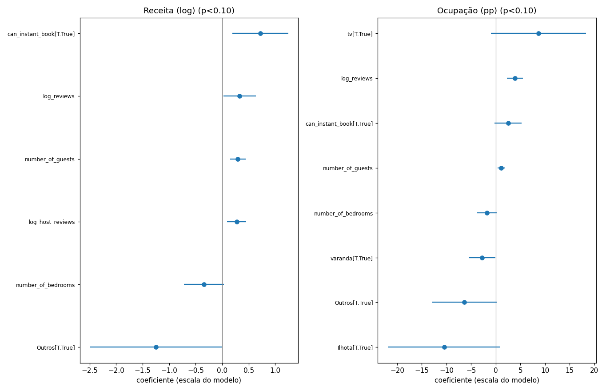

# Fase 4 — Modelo explicativo das receitas

> Modelos OLS sobre dados da Fase 3 (n=999 anúncios com preço).
> - `log_receita`: log-linear → `coef × 100` ≈ variação % na receita mensal por unidade da variável.
> - `occ_pct`: ocupação (proxy, limite inferior do snapshot) em pontos percentuais.
> Confounders controlados: `is_professional`, `host_multi_listing` (hosts profissionais concentram melhores listagens).
> Referência de bairro: **Meia Praia** (coluna removida do modelo — coeficientes de bairro são relativos a ela).

## 1. Modelo de Receita (log-linear)

n=999 | R²=0.089 | R²-aj=0.065 | F-p=2.54e-09

| var                                    |    coef |    ci_lo |   ci_hi |   pvalue |   efeito_pct | p_sig   |
|:---------------------------------------|--------:|---------:|--------:|---------:|-------------:|:--------|
| Intercept                              |  4.6803 |  -4.5441 | 13.9046 |   0.3196 |   10679.7    |         |
| ar_condicionado[T.True]                |  0.5842 |  -1.3277 |  2.4962 |   0.5489 |      79.3605 |         |
| tv[T.True]                             |  1.0844 |  -0.7671 |  2.9358 |   0.2507 |     195.754  |         |
| cozinha[T.True]                        |  0.5371 |  -1.0147 |  2.089  |   0.4971 |      71.1112 |         |
| vista_mar[T.True]                      |  0.2937 |  -0.3514 |  0.9388 |   0.3719 |      34.1351 |         |
| elevador[T.True]                       | -0.2634 |  -0.8122 |  0.2855 |   0.3467 |     -23.1528 |         |
| piscina[T.True]                        | -0.6344 |  -1.6575 |  0.3887 |   0.2239 |     -46.9766 |         |
| churrasqueira[T.True]                  |  0.0452 |  -0.5162 |  0.6065 |   0.8746 |       4.6198 |         |
| academia[T.True]                       |  0.7177 |  -0.5289 |  1.9642 |   0.2589 |     104.963  |         |
| varanda[T.True]                        | -0.3568 |  -0.8678 |  0.1541 |   0.1708 |     -30.0112 |         |
| is_superhost[T.True]                   |  0.4077 |  -0.1025 |  0.9178 |   0.1172 |      50.3295 |         |
| flag_rating_missing[T.True]            | -4.2502 | -13.043  |  4.5427 |   0.3431 |     -98.5738 |         |
| is_professional[T.True]                | -0.3692 |  -1.327  |  0.5886 |   0.4495 |     -30.8724 |         |
| host_multi_listing[T.True]             | -0.2019 |  -0.7474 |  0.3436 |   0.4677 |     -18.2848 |         |
| can_instant_book[T.True]               |  0.7189 |   0.1922 |  1.2456 |   0.0075 |     105.215  | ***     |
| bairro_Centro[T.True]                  | -0.1852 |  -0.8631 |  0.4927 |   0.592  |     -16.9047 |         |
| bairro_Morretes[T.True]                |  0.1888 |  -0.6229 |  1.0004 |   0.6482 |      20.7754 |         |
| bairro_Tabuleiro_dos_Oliveiras[T.True] |  1.2801 |  -0.277  |  2.8373 |   0.107  |     259.717  |         |
| bairro_Casa_Branca[T.True]             | -0.6784 |  -2.5056 |  1.1488 |   0.4664 |     -49.2557 |         |
| bairro_Ilhota[T.True]                  | -1.3139 |  -3.5031 |  0.8753 |   0.2392 |     -73.1222 |         |
| bairro_Outros[T.True]                  | -1.2493 |  -2.4994 |  0.0008 |   0.0501 |     -71.3299 | *       |
| number_of_bedrooms                     | -0.3429 |  -0.723  |  0.0371 |   0.0769 |     -29.0325 | *       |
| number_of_guests                       |  0.2945 |   0.148  |  0.4411 |   0.0001 |      34.2514 | ***     |
| n_amenities                            |  0.0055 |  -0.0177 |  0.0287 |   0.6433 |       0.5492 |         |
| log_host_reviews                       |  0.2729 |   0.0921 |  0.4537 |   0.0031 |      31.3736 | ***     |
| log_reviews                            |  0.3311 |   0.022  |  0.6402 |   0.0358 |      39.2549 | **      |
| star_rating                            | -0.817  |  -2.5559 |  0.9219 |   0.3568 |     -55.8238 |         |

## 2. Modelo de Ocupação (pontos percentuais)

n=999 | R²=0.091 | R²-aj=0.067 | F-p=1.13e-09

| var                                    |   coef_pp |    ci_lo |   ci_hi |   pvalue | p_sig   |
|:---------------------------------------|----------:|---------:|--------:|---------:|:--------|
| Intercept                              |   -3.1278 | -51.2598 | 45.0043 |   0.8986 |         |
| ar_condicionado[T.True]                |    6.3901 |  -3.5863 | 16.3665 |   0.2091 |         |
| tv[T.True]                             |    8.686  |  -0.9748 | 18.3467 |   0.078  | *       |
| cozinha[T.True]                        |    2.3851 |  -5.7122 | 10.4823 |   0.5634 |         |
| vista_mar[T.True]                      |    1.8318 |  -1.5343 |  5.1978 |   0.2858 |         |
| elevador[T.True]                       |   -0.042  |  -2.9061 |  2.822  |   0.977  |         |
| piscina[T.True]                        |   -1.4882 |  -6.8267 |  3.8504 |   0.5845 |         |
| churrasqueira[T.True]                  |   -1.6512 |  -4.5805 |  1.278  |   0.2689 |         |
| academia[T.True]                       |   -0.98   |  -7.4847 |  5.5246 |   0.7675 |         |
| varanda[T.True]                        |   -2.782  |  -5.448  | -0.116  |   0.0409 | **      |
| is_superhost[T.True]                   |    2.1558 |  -0.506  |  4.8176 |   0.1123 |         |
| flag_rating_missing[T.True]            |   -4.0441 | -49.9249 | 41.8368 |   0.8627 |         |
| is_professional[T.True]                |   -2.883  |  -7.8808 |  2.1148 |   0.2579 |         |
| host_multi_listing[T.True]             |   -1.9047 |  -4.751  |  0.9417 |   0.1894 |         |
| can_instant_book[T.True]               |    2.5317 |  -0.2167 |  5.2801 |   0.071  | *       |
| bairro_Centro[T.True]                  |    0.4594 |  -3.0777 |  3.9966 |   0.7989 |         |
| bairro_Morretes[T.True]                |    0.809  |  -3.4263 |  5.0444 |   0.7079 |         |
| bairro_Tabuleiro_dos_Oliveiras[T.True] |    6.4729 |  -1.6521 | 14.5979 |   0.1183 |         |
| bairro_Casa_Branca[T.True]             |   -3.0971 | -12.6313 |  6.4371 |   0.524  |         |
| bairro_Ilhota[T.True]                  |  -10.4844 | -21.9075 |  0.9387 |   0.072  | *       |
| bairro_Outros[T.True]                  |   -6.3487 | -12.8718 |  0.1745 |   0.0564 | *       |
| number_of_bedrooms                     |   -1.8292 |  -3.8122 |  0.1538 |   0.0706 | *       |
| number_of_guests                       |    1.1231 |   0.3582 |  1.8879 |   0.004  | ***     |
| n_amenities                            |    0.0202 |  -0.1009 |  0.1412 |   0.744  |         |
| log_host_reviews                       |    0.6437 |  -0.2996 |  1.5871 |   0.1809 |         |
| log_reviews                            |    3.9219 |   2.3091 |  5.5348 |   0      | ***     |
| star_rating                            |   -1.8438 | -10.9172 |  7.2296 |   0.6901 |         |

## 3. Ranking de impacto (o que MOVE receita de fato)

  - **can_instant_book[T.True]**: +105.2% receita (coef=0.719, p=0.00752)
  - **log_reviews**: +39.3% receita (coef=0.331, p=0.0358)
  - **number_of_guests**: +34.3% receita (coef=0.295, p=8.61e-05)
  - **log_host_reviews**: +31.4% receita (coef=0.273, p=0.00313)

## 4. Separado por tipo de anúncio (apartamento vs casa)

**Apartamento** (n=911, R²=0.090):
| var                                    |    coef |    ci_lo |   ci_hi |   pvalue |   efeito_pct | p_sig   |
|:---------------------------------------|--------:|---------:|--------:|---------:|-------------:|:--------|
| Intercept                              |  2.2826 |  -7.4782 | 12.0434 |   0.6464 |     880.225  |         |
| ar_condicionado[T.True]                |  0.6069 |  -1.3816 |  2.5954 |   0.5493 |      83.4804 |         |
| tv[T.True]                             |  0.9674 |  -1.3201 |  3.2549 |   0.4067 |     163.119  |         |
| cozinha[T.True]                        |  1.0776 |  -0.6439 |  2.7992 |   0.2195 |     193.776  |         |
| vista_mar[T.True]                      |  0.1925 |  -0.4704 |  0.8553 |   0.5689 |      21.224  |         |
| elevador[T.True]                       | -0.2931 |  -0.8752 |  0.2891 |   0.3234 |     -25.4036 |         |
| piscina[T.True]                        | -0.5496 |  -1.7474 |  0.6482 |   0.3681 |     -42.2823 |         |
| churrasqueira[T.True]                  |  0.2487 |  -0.3452 |  0.8427 |   0.4113 |      28.2416 |         |
| academia[T.True]                       |  0.5592 |  -0.7971 |  1.9154 |   0.4186 |      74.9194 |         |
| varanda[T.True]                        | -0.3353 |  -0.8685 |  0.198  |   0.2176 |     -28.4844 |         |
| is_superhost[T.True]                   |  0.453  |  -0.082  |  0.9879 |   0.0969 |      57.298  | *       |
| flag_rating_missing[T.True]            | -2.8801 | -12.0592 |  6.299  |   0.5382 |     -94.3872 |         |
| is_professional[T.True]                | -0.5708 |  -1.5911 |  0.4496 |   0.2725 |     -43.4919 |         |
| host_multi_listing[T.True]             | -0.375  |  -0.9496 |  0.1995 |   0.2005 |     -31.2718 |         |
| can_instant_book[T.True]               |  0.6413 |   0.0894 |  1.1933 |   0.0228 |      89.904  | **      |
| bairro_Centro[T.True]                  | -0.0729 |  -0.7827 |  0.637  |   0.8404 |      -7.0279 |         |
| bairro_Morretes[T.True]                |  0.1733 |  -0.7193 |  1.0658 |   0.7033 |      18.9177 |         |
| bairro_Tabuleiro_dos_Oliveiras[T.True] |  1.5081 |  -0.1728 |  3.189  |   0.0786 |     351.821  | *       |
| bairro_Casa_Branca[T.True]             |  0.0951 |  -1.8723 |  2.0626 |   0.9244 |       9.9822 |         |
| bairro_Ilhota[T.True]                  | -0.6626 |  -3.7341 |  2.4089 |   0.6721 |     -48.4511 |         |
| bairro_Outros[T.True]                  | -2.3775 |  -4.8176 |  0.0627 |   0.0562 |     -90.7214 | *       |
| number_of_bedrooms                     | -0.3677 |  -0.8216 |  0.0862 |   0.1122 |     -30.767  |         |
| number_of_guests                       |  0.2975 |   0.1284 |  0.4667 |   0.0006 |      34.6553 | ***     |
| n_amenities                            |  0.0042 |  -0.0203 |  0.0287 |   0.7358 |       0.4216 |         |
| log_host_reviews                       |  0.3326 |   0.1422 |  0.5229 |   0.0006 |      39.4523 | ***     |
| log_reviews                            |  0.3145 |  -0.0081 |  0.6372 |   0.0561 |      36.9583 | *       |
| star_rating                            | -0.4466 |  -2.2574 |  1.3641 |   0.6284 |     -36.0228 |         |

**Casa** (n=70, R²=0.256):
| var                                    |     coef |    ci_lo |   ci_hi |   pvalue |      efeito_pct | p_sig   |
|:---------------------------------------|---------:|---------:|--------:|---------:|----------------:|:--------|
| Intercept                              |   9.5631 | -16.1709 | 35.2971 |   0.4581 |     1.42294e+06 |         |
| ar_condicionado[T.True]                |   9.5631 | -16.1709 | 35.2971 |   0.4581 |     1.42294e+06 |         |
| tv[T.True]                             |   4.6582 |  -3.0142 | 12.3307 |   0.2278 | 10444.9         |         |
| cozinha[T.True]                        |  -3.9076 | -15.1428 |  7.3275 |   0.4872 |   -97.9912      |         |
| vista_mar[T.True]                      |   1.7963 |  -3.8897 |  7.4823 |   0.5278 |   502.741       |         |
| elevador[T.True]                       |   0      |  -0      |  0      |   0.3416 |     0           |         |
| piscina[T.True]                        |  -0.8728 |  -4.5168 |  2.7712 |   0.6319 |   -58.2214      |         |
| churrasqueira[T.True]                  |   0.0582 |  -3.2434 |  3.3598 |   0.9718 |     5.9916      |         |
| academia[T.True]                       |  10.478  |  -7.2451 | 28.201  |   0.24   |     3.55232e+06 |         |
| varanda[T.True]                        |   0.0033 |  -3.1349 |  3.1416 |   0.9983 |     0.3348      |         |
| is_superhost[T.True]                   |  -0.3304 |  -3.0004 |  2.3396 |   0.8043 |   -28.1364      |         |
| flag_rating_missing[T.True]            | -12.8632 | -65.6152 | 39.8889 |   0.6257 |   -99.9997      |         |
| is_professional[T.True]                |   1.5    |  -2.9692 |  5.9692 |   0.5025 |   348.157       |         |
| host_multi_listing[T.True]             |   0.7578 |  -2.7285 |  4.244  |   0.6636 |   113.353       |         |
| can_instant_book[T.True]               |   0.2964 |  -2.6231 |  3.216  |   0.8389 |    34.505       |         |
| bairro_Centro[T.True]                  |  -0.788  |  -4.9428 |  3.3667 |   0.7042 |   -54.5268      |         |
| bairro_Morretes[T.True]                |  -0.0596 |  -4.0033 |  3.8841 |   0.9759 |    -5.7851      |         |
| bairro_Tabuleiro_dos_Oliveiras[T.True] |  -0.4066 |  -8.1803 |  7.367  |   0.9166 |   -33.4115      |         |
| bairro_Casa_Branca[T.True]             |  -5.5696 | -12.9599 |  1.8206 |   0.136  |   -99.6188      |         |
| bairro_Ilhota[T.True]                  |  -1.5375 |  -6.4797 |  3.4048 |   0.5341 |   -78.5072      |         |
| bairro_Outros[T.True]                  |  -1.1452 |  -4.6414 |  2.351  |   0.5128 |   -68.1839      |         |
| number_of_bedrooms                     |  -1.237  |  -2.9742 |  0.5002 |   0.1584 |   -70.9753      |         |
| number_of_guests                       |   0.4638 |  -0.1607 |  1.0883 |   0.1417 |    59.0113      |         |
| n_amenities                            |  -0.0303 |  -0.1674 |  0.1068 |   0.6586 |    -2.9826      |         |
| log_host_reviews                       |  -0.0681 |  -2.046  |  1.9099 |   0.945  |    -6.581       |         |
| log_reviews                            |   0.8831 |  -1.4609 |  3.2272 |   0.4519 |   141.85        |         |
| star_rating                            |  -3.2214 | -13.987  |  7.5442 |   0.5497 |   -96.01        |         |

## 5. Interpretação para negócio

  - **Ter TV**: ≈ +196% na receita mensal (não-significativo, p=0.251)
  - **Reserva instantânea ativa**: ≈ +105% na receita mensal (significativo, p=0.00752)
  - **Ter ar-condicionado**: ≈ +79% na receita mensal (não-significativo, p=0.549)
  - **Host com selo superhost**: ≈ +50% na receita mensal (não-significativo, p=0.117)
  - **Dobrar o nº de reviews (log)**: ≈ +39% na receita mensal (significativo, p=0.0358)
  - **1 hóspede a mais de capacidade**: ≈ +34% na receita mensal (significativo, p=8.61e-05)
  - **Ter vista para o mar**: ≈ +34% na receita mensal (não-significativo, p=0.372)
  - **Dobrar o nº de reviews do host (log)**: ≈ +31% na receita mensal (significativo, p=0.00313)
  - **Ter elevador**: ≈ -23% na receita mensal (não-significativo, p=0.347)
  - **1 quarto a mais (mantendo hóspedes constantes)**: ≈ -29% na receita mensal (não-significativo, p=0.0769)

> Recomendações diretas: ativar `Reserva instantânea` (+105%), investir em conversão/avaliações
> (dobrar reviews ≈ +39%), dimensionar capacidade de hóspedes (+34%/hóspede); e NÃO tratar 'mais
> quartos' como alavanca — mantendo hóspedes fixos, quarto extra reduz receita média por hóspede.

## 6. Limitações explícitas (senso crítico)

- **Ocupação é proxy inferior**: os coeficientes de ocupação devem ser lidos como *ordem de grandeza*,
  não precisão. Receita usa o mesmo proxy — conclusões absolutas limitadas.
- **Correlação ≠ causa**: amenidades correlacionam com tamanho/área (não temos área m² no Airbnb;
  `number_of_guests`/`number_of_beds` são proxies de área). A direção dos efeitos é o que importa.
- **N pequeno em bairros** (Ilhota n=10, Casa Branca n=15) torna aquelas dummies instáveis.
- **Colinearidade**: `piscina`/`academia`/`varanda` vivem em unidades maiores — isolam-se mal.
- **Snapshot único (jan–abr)**: sazonalidade de fim de ano não é observada.
- **R² baixo (~0.09)**: a maior parte da variação de receita é idiossincrática ou não capturada
  (revolvimento de canais, demanda pontual). O modelo explica DIRECIONAIS, não prediz valores.
