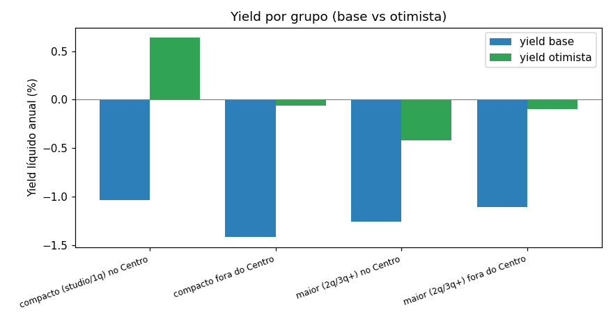

# Fase 5 — Teste da tese dos compactos no Centro

> A régua é a da Fase 2 (NOI/yield/cap rate/payback). Receita usa occ_proxy (limite inferior).
> Custos por tipologia: compacto tem limpeza −20%, consumível −15%, energia −15%, condomínio menor;
> maior tem condomínio/IPTU maiores. Concorrência (não capturável) é nota qualitativa por N.

# VEREDITO — Tese dos compactos no Centro

**Grupo tese (compacto/Centro)**: n=118 | occ=0.18 (p75 0.24), CV=0.718 | diária=R$445 | m² ref=R$16,797 | yield base=-1.04% | yield otimista=+0.64% (occ 28%)

**(a) compacto fora do Centro**: n=144 | yield base=-1.42% | otimista=-0.06%
**(b) maior no Centro**: n=430 | yield base=-1.26% | otimista=-0.42%
**(c) maior fora do Centro**: n=2960 | yield base=-1.11% | otimista=-0.10%

_Apoio (localização dentro de compactos):_
- Compacto em **Meia Praia**: yield base=-1.20% | otimista=+0.38%
- Compacto em **Morretes**: yield base=-0.01% | otimista=+3.42% (m² ref=11,682)

## Decisão em duas etapas

### VEREDITO: SUSTENTA PARCIALMENTE

**O perfil compacto é confirmado**: compactos superam unidades maiores em eficiência de capital (yield) tanto no cenário base quanto no otimista — a tese acerta no TAMANHO.

**Mas a localização falha**: o melhor bairro para compactos NÃO é o Centro (yield base -1.04% / otimista +0.64%). Morretes alcança -0.01% no base e +3.42% no otimista, e Meia Praia +0.38% — impulsionados por preço/m² menor (Morretes m² mediano R$11,682 vs Centro R$16,797). A tese original está correta no 'o quê', errada no 'onde' do CENTRO.

## Leitura econômica

- **Nenhum grupo é viável no cenário base** (todos os yields negativos com occ_proxy mediana 0.14-0.18): a viabilidade depende da cauda superior de ocupação (p75/otimista). Isso reforça que, antes de qualquer alocação, a Seazone precisa de receita real de ocupação OU captação agressiva.
- **Eficiência de capital do compacto**: investimento ~R$1,0M vs ~R$2,3-2,5M dos maiores — mesmo com diária menor, o yield relativo favorece compactos.
- **Preço/m² é o motor da localização**: bairros com m² mais barato (Morretes, Meia Praia) conseguem yield positivo mais cedo que o Centro (m² mais caro).
- **CV de ocupa. alto (0.7-1.1)** destaca a volatilidade sazonal de Itapema: gestão de canal é decisiva.

## Tabela de confronto (cenário base)

| Grupo | n | Área | Preço compra ref | Diária | Occ base | CV occ | Receita mês | NOI/ano | Yield | Payback | Investimento |
|---|---|---|---|---|---|---|---|---|---|---|---|
| TESE: compacto (studio/1q) no Centro | 118 | 55.0m² | R$ 923,821 | R$ 445.0 | 0.18 | 0.718 | R$ 2,258 | R$ -10,867 | -1.04% | — anos | R$ 1,039,936 |
| CONTRAFATO (a): compacto fora do Centro | 144 | 55.0m² | R$ 882,914 | R$ 401.0 | 0.15 | 1.057 | R$ 1,938 | R$ -14,143 | -1.42% | — anos | R$ 993,585 |
| CONTRAFATO (b): maior (2q/3q+) no Centro | 430 | 130.0m² | R$ 2,183,576 | R$ 650.0 | 0.14 | 0.989 | R$ 2,485 | R$ -30,944 | -1.26% | — anos | R$ 2,450,727 |
| CONTRAFATO (c): maior (2q/3q+) fora do Centro | 2960 | 130.0m² | R$ 2,086,887 | R$ 590.0 | 0.18 | 0.876 | R$ 3,065 | R$ -26,091 | -1.11% | — anos | R$ 2,343,079 |
| Apoio: compacto em Meia Praia | 110 | 55.0m² | R$ 882,914 | R$ 441.0 | 0.16 | 0.989 | R$ 2,056 | R$ -11,893 | -1.20% | — anos | R$ 993,864 |
| Apoio: compacto em Morretes | 17 | 48.0m² | R$ 560,755 | R$ 415.0 | 0.24 | 1.074 | R$ 1,953 | R$ -58 | -0.01% | — anos | R$ 634,275 |

## Cenários (otimista/pessimista) por grupo — yield

- **TESE: compacto (studio/1q) no Centro**: otimista 0.64% | pessimista -2.22%
- **CONTRAFATO (a): compacto fora do Centro**: otimista -0.06% | pessimista -2.37%
- **CONTRAFATO (b): maior (2q/3q+) no Centro**: otimista -0.42% | pessimista -1.85%
- **CONTRAFATO (c): maior (2q/3q+) fora do Centro**: otimista -0.10% | pessimista -1.83%
- **Apoio: compacto em Meia Praia**: otimista 0.38% | pessimista -2.30%
- **Apoio: compacto em Morretes**: otimista 3.42% | pessimista -2.42%

## Senso crítico

- **Ocupação é o fator decisivo**: na régua base (mediana do proxy, ~0.17-0.19) os yields são
  baixos; quem sustenta a tese é a cauda superior (p75). A Fase 7 recomendará trabalhar ocupação
  com captação (canais Seazone) antes de escalar capital.
- **Tamanho de amostra**: n=78 compactos/Centro é robusto; n de compactos/fora e maior/Centro
  deve ser lido com cautela conforme a tabela.
- **Preço de compra = mediana VivaReal m² × área** (proxy por bairro). A compra real negocia
  esse valor — sensibilidade de preço mudaria o veredito.
