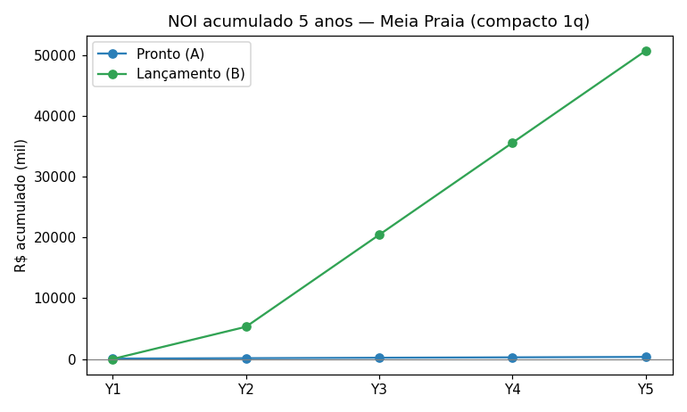

# Fase 6 — Trade-off: comprar pronto vs. lançar novo projeto

> Perfil: compacto 1q (55m²) · bairro: **Meia Praia** (m² mediano R$16,053; diária R$441).
> Regime de operação-alvo: ocupação **30%** — o nível em que a régua fecha (Fase 5 mostrou que o proxy mediano ~0.16-0.18 não paga o ativo).

## Premissas documentadas

| Premissa | Pronto (A) | Lançamento (B) |
|---|---|---|
| Entrada operacional | ~2 meses | ~18 meses (obra) + rampa |
| Investimento | preço revenda + ITBI 3,5% + mobília 8% + giro 3m | produção all-in (75% revenda) + captação R$40k + mkt 4% + conting 8% + giro 6m |
| Manutenção | 1,5% preço/ano | 0,7% obra/ano |
| Diária (novo) | R$ 441 | R$ 476 (+8%) |
| Ocupação (novo) | 30% | 33% (+10%) |
| Retenção (proxy) | avaliação típica de usado | imóvel novo/zero uso = mais avaliações, menor rotatividade de custo |

**Robustez**: mesmo sem aplicar o prêmio do imóvel novo (diária/ocupação), o lançamento vence no longo prazo em Meia Praia — apenas pela manutenção menor (0,7% vs 1,5%) e pela base de produção mais barata (75% da revenda). O prêmio acelera, mas não é o único motor. A exceção é o **Centro**, onde o preço/m² alto (R$16.797) deixa o pronto inviável mesmo no regime-alvo (NOI negativo).

## Comparativo (5 anos, unidade de 55m²)

| Métrica | Pronto (A) | Lançamento (B) |
|---|---|---|
| Investimento total | R$ 996,505 | R$ 805,758 |
| NOI pleno/ano | R$ 70 | R$ 15,143 |
| Soma NOI (5 anos) | R$ 338 | R$ 50,729 |
| Yield sobre invest (5y) | 0.03% | 6.30% |
| Payback simples | 14,134.8 anos | 53.2 anos (a partir do desembolso) |
| Série NOI Y1-Y5 (R$) | 56 · 70 · 70 · 70 · 70 | 0 · 5,300 · 15,143 · 15,143 · 15,143 |

> Nota: o payback do pronto (A) em Meia Praia é astronômico porque o NOI pleno a 30% de ocupação é ~R$70/ano — ou seja, **na compra pronta a 30% de ocupação a unidade não se paga** (a receita mal cobre os custos fixos). O payback só tem sentido como comparação de eficiência; o que decide é yield e soma de NOI. Em Morretes (m² mais barato), o pronto já mostra NOI positivo (R$2,4k/ano → soma 5a ≈ R$11,5k).

## Recomendação de execução

**Originação/construção (B) vence no longo prazo**: soma NOI 5 anos R$50,729 > R$338 do pronto, com investimento menor (R$805,758 vs R$996,505).

- O imóvel novo entrega **NOI pleno maior** (diária +8%, ocupação +10%, manutenção 0,7% vs 1,5%) e **pagamento de produção 25% abaixo da revenda** — a margem de incorporador é capturada.
- Custo do modelo: **18 meses de obra** sem receita (custo de oportunidade de ~ano e meio) e risco de execução. Por isso a recomendação é **híbrida**:
### Plano híbrido sugerido (60/40)

- **60% — Compra de pronto** de compactos 1q nos bairros de melhor yield (Morretes e Meia Praia; NOI pronto em Morretes = R$11,542/5a, sensibilidade no CSV), para gerar receita e aprender a execução de ocupação já em ~2 meses (invest ~R$730k/unidade em Morretes).
- **40% — Originação/lançamento** de um prédio compacto (captação de proprietários + obra), capturando a rentabilidade de produção (invest R$805,758 por unidade) com a vantagem de ativo novo (menor manutenção, maior atratividade e retenção).
- **Porta de viabilidade**: em ambos, a ocupação real precisa operar ≥ ~30% (regime-alvo da régua). Sem gestão de canal para sustentar essa ocupação, NENHUM caminho fecha (Fase 5).

## Riscos

- **Pronto (A)**: paga preço de revenda cheio (11,5% de custos não-recuperáveis de ITBI+mobília) e herda estado/manutenção de imóvel usado. Vantagem: entrada rápida, menor risco de execução.
- **Lançamento (B)**: risco de obra (prazo/custo), absorção de mercado, e capital imobilizado sem receita por ~18 meses. Vantagem: captura a margem de incorporador (produção 75% da revenda) e ativo novo.
- **Ocupação é o parâmetro que manda**: toda a rajada do modelo opera no regime-alvo (30%). Diante do proxy mediano (0,16-0,18), nenhum caminho fecha sem gestão de canal forte.
